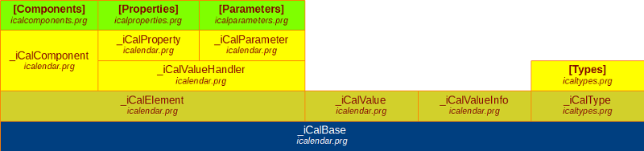

# iCal4VFP :: Classes

Go to
- [Overview](README.md "Overview")
- [Examples](examples.md "Examples")

## Classes

For every Component, Property, Parameter, and Structured Type specified by RFC5545 there is a corresponding class definition (for instance, `iCalCompVEVENT`, `iCalPropDTSTART`, `iCalParmTZID`, and `iCalTypeDURATION`). When the name of the iCalendar element includes an hyphen, the corresponding name in the VFP class set uses an underscore symbol instead (for instance, `iCalPropLAST_MODIFIED`).

Values can be assigned to parameters and properties; parameters can be added to properties: properties and components can be added to components.

Values are also treated as objects, with specific methods to Set and Get them.

### Base classes

	_iCalBase
		_iCalElement
			_iCalComponent
			_iCalValueHandler
				_iCalProperty
				_iCalParameter
		_iCalValue
		_iCalValueInfo
		_iCalType
			iCalTypePERIOD
			iCalTypeDURATION
			iCalTypeRECUR

### ICSProcessor class

The ICSProcessor class is intended to process an iCalendar formatted source: an `.ics` file, or a iCalendar formatted string.

#### Methods

| Name  | Type  | Obs |
| ------------ | ------------ | ------------ |
| Read  | O  | Reads an iCalendar formatted string, and returns an `iCalendar` object  |
| ReadFile  | O  | Reads an `.ics` file, and returns an `iCalendar` object |
| ICSToCursor | N | Creates a simplified flat cursor over some iCalendar source (an `iCalendar` object, an `.ics` file, or a formatted string) |

### Components classes

In iCalendar, components are container objects that integrate properties and, eventually, other components. They can be initialized and defined as a sequence of `CREATEOBJECT()` function calls, or through a method of the ICSProcessor class.

	iCalendar
	iCalCompVEVENT
	iCalCompVTODO
	iCalCompVJOURNAL
	iCalCompVFREEBUSY
	iCalCompVTIMEZONE
	iCalCompVALARM
	iCalCompSTANDARD
	iCalCompDAYLIGHT

#### Methods (common)

| Name  | Type  | Obs |
| ------------ | ------------ | ------------ |
| Parse  | L | Parses a formatted segment of an iCalendar formatted element, a line at a time |
| Serialize | C | Produces an iCalendar formatted object |
| AddICComponent | O | Adds an `_iCalComponent` based object |
| GeICComponent | O | Returns a previously added `_iCalComponent` based object |
| GeICComponentsCount | N | Returns the number of previously added `_iCalComponent` based objects |
| AddICProperty | O | Adds an `_iCalProperty` based object |
| GeICProperty | O | Returns a previously added `_iCalProperty` based object |
| GeICPropertiesCount | N | Returns the number of previously added `_iCalProperty` based objects |
| GeICPropertyValue | * | Returns the value of a previously added `_iCalProperty` based object |

#### Methods (iCalendar)

| Name  | Type  | Obs |
| ------------ | ------------ | ------------ |
| GetTimezone  | O | Returns the VTIMEZONE object that corresponds to a TZID |

#### Methods ( iCalCompVTIMEZONE)

| Name  | Type  | Obs |
| ------------ | ------------ | ------------ |
| NextSavingTimeChange | T | Returns the next time in which a saving time change will occur, for a given date |
| SavingTime | N | Returns the saving time (in seconds) for a given date |
| ToLocalTime | T | Returns the local time corresponding to a given UTC time |
| ToUTC | T | Returns the UTC time corresponding to a given local time |

### Properties classes

	iCalPropACTION
	iCalPropATTACH
	iCalPropATTENDEE
	iCalPropCALSCALE
	iCalPropCATEGORIES
	iCalPropCLASS
	iCalPropCOMMENT
	iCalPropCOMPLETED
	iCalPropCONTACT
	iCalPropCREATED
	iCalPropDESCRIPTION
	iCalPropDTEND
	iCalPropDTSTAMP
	iCalPropDTSTART
	iCalPropDUE
	iCalPropDURATION
	iCalPropEXDATE
	iCalPropFREEBUSY
	iCalPropGEO
	iCalPropLAST_MODIFIED
	iCalPropLOCATION
	iCalPropMETHOD
	iCalPropORGANIZER
	iCalPropPERCENTCOMPLETE
	iCalPropPRIORITY
	iCalPropPRODID
	iCalPropRDATE
	iCalPropRECURRENCE_ID
	iCalPropRELATED_TO
	iCalPropREPEAT
	iCalPropREQUEST_STATUS
	iCalPropRESOURCES
	iCalPropRRULE
	iCalPropSEQUENCE
	iCalPropSTATUS
	iCalPropSUMMARY
	iCalPropTRANSP
	iCalPropTRIGGER
	iCalPropTZID
	iCalPropTZNAME
	iCalPropTZOFFSETFROM
	iCalPropTZOFFSETTO
	iCalPropTZURL
	iCalPropUID
	iCalPropURL
	iCalPropVERSION

#### Methods (common)

| Name  | Type  | Obs |
| ------------ | ------------ | ------------ |
| Parse  | L | Parses a formatted rpresentation of a property, including its parameters |
| Serialize | C | Produces an iCalendar formatted property |
| SetValue | * | Sets the property value |
| GetValue | * | Returns the property value |
| GetValueCount | N | Returns the number of value elements (in a list) |
| UnsetValue | * | Clears the property value |
| AddICParameter | O | Adds an `_iCalParameter` based object |
| GeICParameter | O | Returns a previously added `_iCalParameter` based object |
| GeICParametersCount | N | Returns the number of previously added `_iCalParameter` based objects |
| GeICParameterValue | * | Returns the value of a previously added `_iCalParameter` based object |

#### Methods (iCalPropRRULE)

| Name  | Type  | Obs |
| ------------ | ------------ | ------------ |
| CalculateAll  | C | Calculates all events determined by a recurrent rule (returns a cursor name defined as `(LocalTime Datetime, TzName Varchar(32)`) |
| CalculatePrevious | T | Calculates the previous date of a recurrent event (a copy of the result is stored in the `.PreviousDate` property, and the timezone in `.PreviousTzName`) |
| CalculateNext | T | Calculates the next date of a recurrent event (a copy of the result is stored in the `.NextDate` property, and the timezone in `.NextTzName`) |
| CalculatePeriod | - | Calculates the previous and next dates of a recurrent event (the result is stored in the properties used in the other `Calculate*` methods) |

### Parameters classes

	iCalParmALTREP
	iCalParmCN
	iCalParmCUTYPE
	iCalParmDELEGATED
	iCalParmDIR
	iCalParmENCODING
	iCalParmFMTTYPE
	iCalParmFBTYPE
	iCalParmLANGUAGE
	iCalParmMEMBER
	iCalParmPARTSTAT
	iCalParmRANGE
	iCalParmRELATED
	iCalParmRELTYPE
	iCalParmROLE
	iCalParmRSVP
	iCalParmSENT_BY
	iCalParmTZID
	iCalParmVALUE

#### Methods (common)

| Name  | Type  | Obs |
| ------------ | ------------ | ------------ |
| Parse  | L | Parses a formatted rpresentation of a parameter |
| Serialize | C | Produces an iCalendar formatted parameter |
| SetValue | * | Sets the parameter value |
| GetValue | * | Returns the parameter value |
| GetValueCount | N | Returns the number of value elements (in a list) |
| UnsetValue | * | Clears the parameter value |
